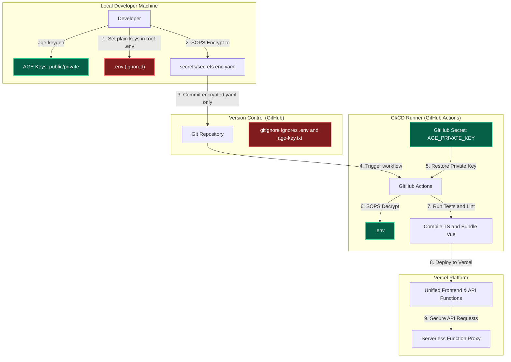

# The Chronicle - World & Technology News Portal (SOPS + AGE + GitHub Actions Demo)

A production-quality, serverless world and technology news portal named **The Chronicle** that demonstrates secure secret isolation. The API credentials are encrypted in Git via SOPS/AGE, decrypted during automated CI/CD runs, and consumed by native **Vercel Serverless Functions** without ever leaking to the client-side Vue 3 application.

---

## 🏗️ Architecture Overview

The following diagram illustrates the lifecycle of secrets from local development to production deployment:



---

## 🔒 Security Principles

### 1. Why Not Store `.env` Files in Git?
Storing raw `.env` or plaintext configuration files in Git is a major security vulnerability:
- **Exposed History**: Once a secret is pushed to a Git repository, it remains in the Git commit history forever. Deleting the file in a new commit does not remove it from past commits.
- **Accidental Public Exposure**: Public repositories expose keys instantly to crawlers. Private repositories are also vulnerable to credential harvesting by compromised developer accounts, rogue third-party packages, or data breaches.
- **Lack of Access Controls**: Git repositories do not support granular access control on file paths. Anyone with read access to the code has full access to production database credentials, API keys, and certificates.

### 2. How Mozilla SOPS Works
**SOPS (Secrets Operations)** is an editor/CLI tool that encrypts YAML, JSON, ENV, INI, and BINARY files. 
- It encrypts the **values** of the configuration keys while leaving the **keys themselves unencrypted**. This allows developers to read the structure of the config file and review git diffs easily.
- It uses envelope encryption. The data is encrypted with a localized data key, and that data key is then encrypted using one or more master keys (like AGE, AWS KMS, GCP KMS, Vault, or PGP).

### 3. How AGE Works
**AGE (Actually Good Encryption)** is a modern, simple, and secure file encryption tool, designed to replace GPG/PGP.
- It uses small, lightweight keys (X25519 public keys and X25519 private keys).
- It is extremely fast and has no complex keyring configurations.
- Because it is standard and simple, it is highly suitable for automated pipelines and DevOps container integration.

---

## 📁 Project Structure

```text
project-root/
├── .github/
│   └── workflows/
│       └── deploy.yml      # CI/CD pipeline configuration
├── api/
│   ├── _utils/
│   │   └── news.ts         # Shared news types, mock database & utilities
│   ├── categories.ts       # Serverless function: categories API
│   ├── health.ts           # Serverless function: health API
│   ├── news.ts             # Serverless function: category news proxy API
│   ├── secret-status.ts    # Serverless function: secret metadata API
│   └── news/
│       ├── search.ts       # Serverless function: news search API
│       └── trending.ts     # Serverless function: trending news API
├── frontend/
│   ├── src/
│   │   ├── plugins/
│   │   │   └── vuetify.ts  # Vuetify config & design styling
│   │   ├── router/
│   │   │   └── index.ts    # Frontend single-route definition
│   │   ├── views/          # Views
│   │   │   └── HomeView.vue # Combined single-page news portal
│   │   ├── App.vue         # Main layout shell with custom navbar
│   │   └── main.ts         # Vue entry point
│   ├── vite.config.ts      # Vite & Vitest config
│   ├── tsconfig.json       # Frontend TypeScript config
│   └── package.json        # Frontend dependencies & scripts
├── secrets/
│   ├── secrets.yaml        # Plaintext local secrets (ignored by Git)
│   └── secrets.enc.yaml    # Encrypted secrets (safe to commit to Git)
├── bin/                    # Downloaded SOPS & AGE binaries (local only)
├── .gitignore              # Protects secrets.yaml, age-key.txt, and .env
├── .env                    # Local environment config (never committed!)
├── .sops.yaml              # SOPS encryption mapping configuration
├── vercel.json             # Vercel deployment routes and build settings
├── package.json            # Root workspace scripts (orchestrator)
└── README.md               # Main project documentation
```

---

## 🛠️ Step-by-Step Local Setup & Commands

### Prerequisites
- Node.js v20.x
- npm

### 1. Download Local SOPS & AGE Binaries
If you don't have SOPS and AGE installed on your system, you can fetch them inside the project using:
```bash
# Create local bin folder and download binaries
mkdir -p bin
curl -LO "https://github.com/getsops/sops/releases/download/v3.9.0/sops-v3.9.0.linux.amd64" && mv sops-v3.9.0.linux.amd64 bin/sops && chmod +x bin/sops
curl -LO "https://dl.filippo.io/age/latest?for=linux/amd64" && tar -xzf latest?for=linux%2Famd64 -C bin --strip-components=1 && chmod +x bin/age bin/age-keygen
```

### 2. Generate AGE Keypair
```bash
bin/age-keygen -o age-key.txt
```
This generates a private key (stored in `age-key.txt`) and outputs a public key matching:
`public key: age1...`

### 3. Update `.sops.yaml`
Add your public key to `.sops.yaml` creation rules:
```yaml
creation_rules:
  - path_regex: secrets/.*\.yaml$
    age: <your-public-key-here>
```

### 4. Configure Local Environment Variables
For local development, copy the `.env.example` file to `.env` in the **project root directory** and add your keys:
```env
NEWS_API_AI_KEY=your_newsapi_ai_key_here
ENVIRONMENT=development
VITE_PROJECT_NAME='The Chronicle'
```
*(This file is blocked by `.gitignore` and won't be committed to Git. VITE_API_URL can be omitted or left empty since the frontend and functions share the same origin port).*

### 5. Encrypt Secrets (For Production/Server Use)
Create your plaintext production config file in `secrets/secrets.yaml`:
```yaml
API_KEY: super-secret-demo-key
ENVIRONMENT: production
NEWS_API_AI_KEY: your_newsapi_ai_key_here
```
Then encrypt it:
```bash
bin/sops --encrypt secrets/secrets.yaml > secrets/secrets.enc.yaml
```
Verify that `secrets.enc.yaml` contains encrypted values and metadata blocks.

### 6. Run the Application Locally
Install all dependencies and run dev servers:
```bash
# Install root and frontend packages
npm run install-all

# Boot development mode (runs Vercel dev gateway proxying frontend and serverless routes)
npm run dev
```
The application will be available at `http://localhost:3000`.

### 7. Run All Test Suites
Verify all frontend component and dashboard tests:
```bash
npm run test
```

---

## 🚀 GitHub Actions Setup (CI/CD)

To configure the deployment pipeline:
1. Go to your GitHub repository -> **Settings** -> **Secrets and variables** -> **Actions**.
2. Click **New repository secret** and add:
   * **`AGE_PRIVATE_KEY`**: Paste the raw content of your private key (from `age-key.txt`, e.g., `AGE-SECRET-KEY-1D37...`).
   * **`VERCEL_TOKEN`**: Your Vercel API token.
   * **`VERCEL_ORG_ID`**: Your Vercel organization ID.
   * **`VERCEL_PROJECT_ID`**: Your Vercel project ID.
3. Push your code (ensuring `.gitignore` blocks `.env`, `secrets.yaml`, and `age-key.txt`). The pipeline will run, restore the keys, decrypt `secrets.enc.yaml` into `.env`, verify tests, and deploy directly to Vercel.

---

## 🔒 Security Considerations & Common Mistakes

- **Mistake: Committing the `age-key.txt` file.** 
  *Fix:* Double check that `age-key.txt` is listed in your root `.gitignore` before initializing Git.
- **Mistake: Committing the decrypted `.env` file.**
  *Fix:* Ensure `.env` is explicitly ignored at the root and folder level.
- **Mistake: Exposing `process.env.NEWS_API_AI_KEY` directly to the client.**
  *Fix:* Never create endpoints like `GET /api/get-keys` that return plain values. Keep all raw keys hidden on the backend.
- **Mistake: Using frontend environment variables (`VITE_NEWS_API_KEY`) for backend API secrets.**
  *Fix:* Vite bundles variables starting with `VITE_` directly into the client-side JavaScript, rendering them viewable to anyone using browser inspector tools. Keep all master credentials on the backend.
